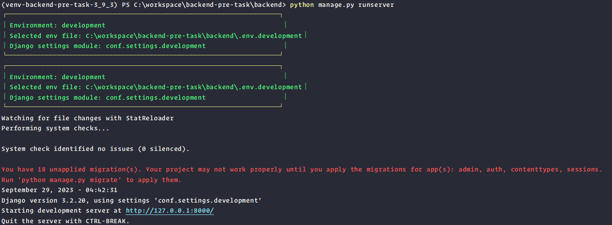
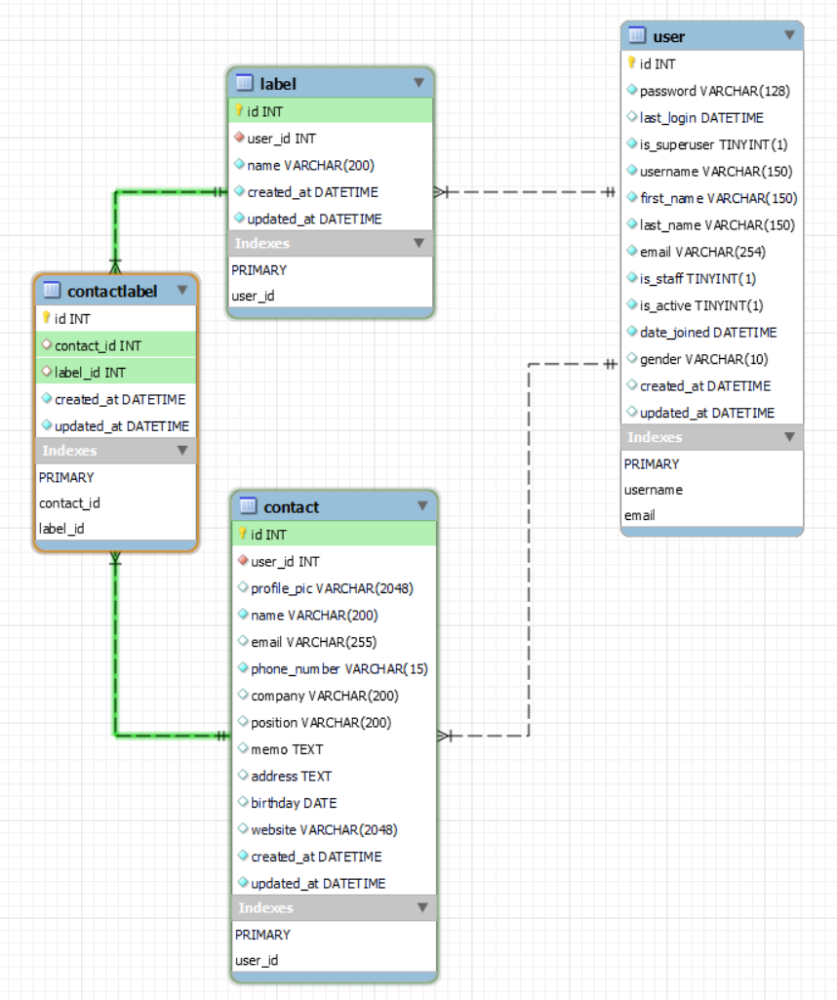
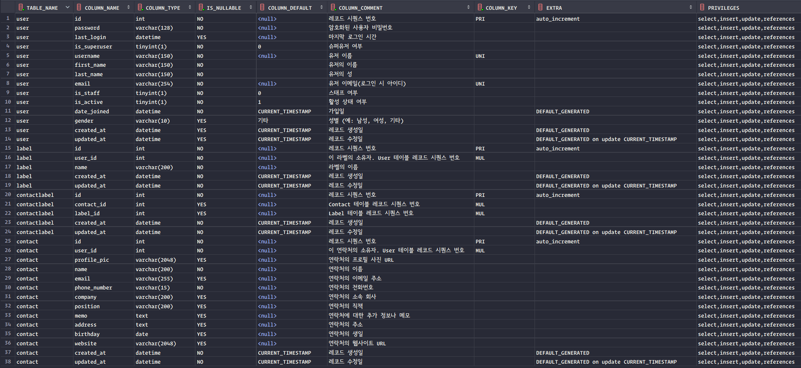

# Backend README.md

***

### 주요 버전
* Python: `3.9.3`
* Django: `3.2.20`
* Django REST Framework: `3.14.0`
* DBMS: MySQL (ver. `8.0.27`)

### 가상환경
* virtual environment 생성/연동
```bash
python -m venv <가상환경 경로 포함 이름>
```

***

### 작업경로
> 작업경로를 변경합니다.
* 워크스페이스: `C:\workspace`
* 프로젝트 루트: `C:\workspace\backend-pre-task`
* 장고프로젝트 루트: `C:\workspace\backend-pre-task\backend`
* 장고프로젝트 이름: `C:\workspace\backend-pre-task\backend` + `\conf`
* manage.py 위치: `C:\workspace\backend-pre-task\backend` + `manage.py`
```bash
(가상환경 이름) PS C:\workspace\backend-pre-task\>
```

### Ready Setups
- **`requirements.in`**: 운영 기준 패키지 목록 (production)
- **`requirements-dev.in`**: 개발 기준 패키지 목록 (development)
- **`requirements-exp.txt`**: 개발시 아직 실험단계 패키지 목록 (experiment)
```bash
python.exe -m pip install --upgrade pip
pip install pip-tools
pip-compile requirements.in  # 시간 걸림
pip-compile requirements-dev.in -o requirements-dev.txt  # 시간 걸림
```
> * **Output:** ~/requirements.txt 
> * **Output:** ~/requirements-dev.txt
> > * **Setups-doc**: ./requirements.txt, ./requirements-dev.txt

### Edit Setups-doc
> 생성된 `requirements.txt`와 `requirements-dev.txt` 상단에 `Python Micro 버전`까지 명시하도록 자동 수정
> ```bash
> python requirements-version.py
> ```

### Setups
> * 개발환경구축
> ```bash
> pip install -r requirements-dev.txt  # 개발 의존성
> ```
> * 운영환경구축
> 
> ```bash
> pip install -r requirements.txt  # 운영 의존성
> ```

### Do Sync with Setups-doc & Env
> `requirements.dev, requirements-dev.txt`에 명시한 패키지를 제외한 나머지 패키지는
> > `실제 설치된 패키지` 환경에서 제거하여
> > 의존성문서 방향으로 실제환경을 동기화
```bash
pip-sync requirements.txt requirements-dev.txt
```

### Confirm core-packages version
```bash
python -V
python -m django --version
python -m pip show djangorestframework
```

***

### 작업경로
> 작업경로를 변경합니다.
* 워크스페이스: `C:\workspace`
* 프로젝트 루트: `C:\workspace\backend-pre-task`
* 장고프로젝트 루트: `C:\workspace\backend-pre-task\backend`
* 장고프로젝트 이름: `C:\workspace\backend-pre-task\backend` + `\conf`
* manage.py 위치: `C:\workspace\backend-pre-task\backend` + `manage.py`
```bash
(가상환경 이름) PS C:\workspace\backend-pre-task\backend>
```

### Create <프로젝트루트>
> 필요시 수행
```bash
cd <워크스페이스>
mkdir <프로젝트루트>
```

### Create django-project

* 장고프로젝트(이름: conf) 생성 예시
```bash
(가상환경 이름) PS C:\workspace\backend-pre-task\backend> django-admin startproject conf .
```

```bash
django-admin startproject <장고프로젝트이름> <프로젝트루트이름>
```
```bash
backend-pre-task
└── <프로젝트루트 이름>/            # 프로젝트 루트 
    ├── manage.py (명령모듈)       # Django의 커맨드라인 유틸리티
    └── <장고프로젝트이름>/         # 내부의 Django 프로젝트
        ├── __init__.py
        ├── urls.py                # URL 설정 파일
        ├── asgi.py                # ASGI 설정 파일 (비동기 서버 환경을 위한 설정)
        ├── wsgi.py                # WSGI 설정 파일 (웹 서버 환경을 위한 설정)
        └── settings/              # Django 프로젝트 설정 파일 (base, production, development, test)
               ├── __init__.py
               ├── base.py         # 공통. 최상위.
               ├── development.py  # 개발
               ├── production.py   # 운영
               └── test.py         # 유닛테스트
```

### Settting `.env`, `.env.*` file
> * **@see** [Backend Team .env.* 파일 설정가이드 문서](https://agate-scowl-3a9.notion.site/Backend-Team-a372333eccf84a5ba19c0ee2961e72d0?pvs=4)

### Runserver (Recommended)
> > 가장 먼저 `.env` 설정파일에 `ENVIRONMENT` 환경변수 값을 설정해야함
> > * 값은 다음 중 하나로 설정
> >   * development: 개발환경
> >   * production: 운영환경
> ```bash
> ENVIRONMENT=development
> ```
> ```bash
> python manage.py runserver
> ```
> * 모습
> > 

### Pycharm > 장고프로젝트 인식 설정
> * Django
> > 

### Pycharm > Run Configurations 설정
> * 추가
> ```bash
> ;DJANGO_SETTINGS_MODULE=conf.settings.development
> ```
> * Django Server
> > 

### Pycharm > Debugger 이슈
> * `2023-09-29` 현재 `Pycharm`에서 `Django`를 `Debug` 모드로 실행시키면 `Django`의 `runserver`가 `Debug` 모드로 실행되지 않는 이슈가 있음

### (`@deprecated`) Runserver (수동 settings파일 주입 방식)
> > python manage_legacy.py runserver --settings=<장고프로젝트이름>.settings.<구동 원하는 settings.py 이름>
> * Usage
> ```bash
> python manage_legacy.py runserver --settings=conf.settings.development
> python manage_legacy.py runserver --settings=conf.settings.production
> ```

***

### DDL/Dummy-data SQL 반영 순서 (순서대로)
1. `schema.sql` 전체 순차 적용 
  * > MysqlWorkbench 사용경우 단축키:
    > >  전체선택상태 ctrl + shift + enter
2. `data.sql` 전체 순차 적용 
  * > MysqlWorkbench 사용경우 단축키:
    > >  전체선택상태 ctrl + shift + enter

### ERD/DB Description
> * ERD
> > 
> * DB Description
> > 

### Create Database(File-based), Migrate DB(with Built-in migration files), Create superuser
```bash
python manage.py migrate
python manage.py createsuperuser
```

### Create django-app directory structure and Create django-app
```bash
cd <워크스페이스>/<프로젝트루트>
mkdir mkdir <장고앱들 관리 디렉토리>\<장고앱이름>
python .\manage.py startapp <장고앱이름> .\<장고앱들 관리 디렉토리>\<장고앱이름>
```
> 주소록 API라서 장고앱 `addressbook`이라고 명명
> ```bash
> mkdir apps\addressbook
> python .\manage.py startapp addressbook .\apps\addressbook
> ```

### Create API-centric directory structure
> ```bash
> cd <워크스페이스>/<프로젝트루트>
> mkdir api
> mkdir api\v1
> mkdir api\v1\<모델 클래스 이름>
> mkdir api\v1\tests
> ```
> models.py의 `도메인` 별 폴더 생성
> ```bash
> mkdir api
> mkdir api\v1
> mkdir api\v1\contact
> mkdir api\v1\label
> mkdir api\v1\contact-label
> ```

### Create Project's output resources directory structure
```bash
cd <워크스페이스>/<프로젝트루트>
mkdir .resouurces
```
