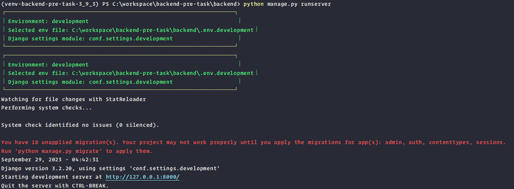
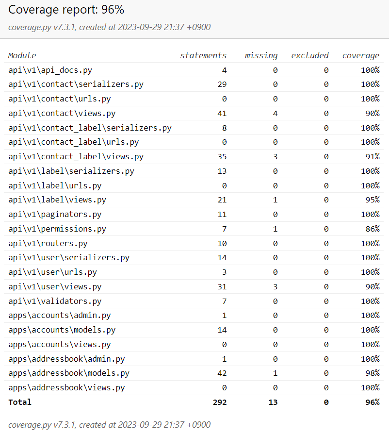

<div style="margin-bottom: -38px;"> 


</div>

# Backend README.md

***

### 주요 버전
* Python: `3.9.3`
* Django: `3.2.20`
* Django REST Framework: `3.14.0`
* DBMS: MySQL (ver. `8.0.27`)

<p style="display: inline-block; vertical-align: middle;">현재 code coverage는</p> 

<p style="display: inline-block; vertical-align: middle;">입니다.</p>

***

# 1. 개발환경 구축 

> 의존성, 장고프로젝트, 장고앱, .env.* 파일, 서버실행

### 가상환경
* virtual environment 생성/연동
```bash
python -m venv <가상환경 경로 포함 이름>
```

***

### 작업경로
> 작업경로를 변경합니다.
* 워크스페이스: `C:\workspace`
* 프로젝트 루트: `C:\workspace\backend-pre-task`
* 장고프로젝트 루트: `C:\workspace\backend-pre-task\backend`
* 장고프로젝트 이름: `C:\workspace\backend-pre-task\backend` + `\conf`
* manage.py 위치: `C:\workspace\backend-pre-task\backend` + `manage.py`
```bash
(가상환경 이름) PS C:\workspace\backend-pre-task\>
```

### Ready Setups
- **`requirements.in`**: 운영 기준 패키지 목록 (production)
- **`requirements-dev.in`**: 개발 기준 패키지 목록 (development)
- **`requirements-exp.txt`**: 개발시 아직 실험단계 패키지 목록 (experiment)
```bash
python.exe -m pip install --upgrade pip
pip install pip-tools
pip-compile requirements.in  # 시간 걸림
pip-compile requirements-dev.in -o requirements-dev.txt  # 시간 걸림
```
> * **Output:** ~/requirements.txt 
> * **Output:** ~/requirements-dev.txt
> > * **Setups-doc**: ./requirements.txt, ./requirements-dev.txt

### Edit Setups-doc
> 생성된 `requirements.txt`와 `requirements-dev.txt` 상단에 `Python Micro 버전`까지 명시하도록 자동 수정
> ```bash
> python requirements-version.py
> ```

### Setups
> * 개발환경구축
> ```bash
> pip install -r requirements-dev.txt  # 개발 의존성
> ```
> * 운영환경구축
> 
> ```bash
> pip install -r requirements.txt  # 운영 의존성
> ```

### Do Sync with Setups-doc & Envionment(Dev, Prod)
> `requirements.dev, requirements-dev.txt`에 명시한 패키지를 제외한 나머지 패키지는
> > `실제 설치된 패키지` 환경에서 제거하여
> > 의존성문서 방향으로 실제환경을 동기화
```bash
pip-sync requirements.txt requirements-dev.txt
```

### Confirm core-packages version
```bash
python -V
python -m django --version
python -m pip show djangorestframework
```

***

### 작업경로
> 작업경로를 변경합니다.
* 워크스페이스: `C:\workspace`
* 프로젝트 루트: `C:\workspace\backend-pre-task`
* 장고프로젝트 루트: `C:\workspace\backend-pre-task\backend`
* 장고프로젝트 이름: `C:\workspace\backend-pre-task\backend` + `\conf`
* manage.py 위치: `C:\workspace\backend-pre-task\backend` + `manage.py`
```bash
(가상환경 이름) PS C:\workspace\backend-pre-task\backend>
```

### Create <프로젝트루트>
> 필요시 수행
```bash
cd <워크스페이스>
mkdir <프로젝트루트>
```

### Create django-project

* 장고프로젝트(이름: conf) 생성 예시
```bash
(가상환경 이름) PS C:\workspace\backend-pre-task\backend> django-admin startproject conf .
```

```bash
django-admin startproject <장고프로젝트이름> <프로젝트루트이름>
```
```bash
backend-pre-task
└── <프로젝트루트 이름>/            # 프로젝트 루트 
    ├── manage.py (명령모듈)       # Django의 커맨드라인 유틸리티 (개발/운영 Config로 알아서 인식)
    ├── manage_legacy.py (명령모듈)# Django의 커맨드라인 유틸리티 (명령어 인자로 직접 주입)
    └── <장고프로젝트이름>/         # 내부의 Django 프로젝트
        ├── __init__.py
        ├── urls.py                # URL 설정 파일
        ├── asgi.py                # ASGI 설정 파일 (비동기 서버 환경을 위한 설정)
        ├── wsgi.py                # WSGI 설정 파일 (웹 서버 환경을 위한 설정)
        └── settings/              # Django 프로젝트 설정 파일 (base, production, development, test)
               ├── __init__.py
               ├── base.py         # 공통. 최상위.
               ├── development.py  # 개발
               ├── production.py   # 운영
               └── test.py         # 유닛테스트
```

### Create Database(File-based), Migrate DB(with Built-in migration files), Create superuser
* 필요시 최초 1회 수행
```bash
python manage.py migrate
python manage.py createsuperuser
```

### Settting `.env`, `.env.*` file
> * **@see** [Backend Team .env.* 파일 설정가이드 문서](https://agate-scowl-3a9.notion.site/Backend-Team-a372333eccf84a5ba19c0ee2961e72d0?pvs=4)

### Runserver (Recommended)
> > 가장 먼저 `.env` 설정파일에 `ENVIRONMENT` 환경변수 값을 설정해야함
> > * 값은 다음 중 하나로 설정
> >   * development: 개발환경
> >   * production: 운영환경
> ```bash
> ENVIRONMENT=development
> ```
> ```bash
> python manage.py runserver
> ```
> * 모습
> > 

### Pycharm > 장고프로젝트 인식 설정
> * Django
> > 

### Pycharm > Run Configurations 설정
> * 추가
> ```bash
> ;DJANGO_SETTINGS_MODULE=conf.settings.development
> ```
> * Django Server
> > 

### Pycharm > Debugger 이슈
> * `2023-09-29` 현재 `Pycharm`에서 `Django`를 `Debug` 모드로 실행시키면 `Django`의 `runserver`가 `Debug` 모드로 실행되지 않는 이슈가 있음
> * FIXED. 
> > * [해결방법 정리 #13](https://github.com/humblem2/backend-pre-task/issues/13) 

### (`@deprecated`) Runserver (수동 settings파일 주입 방식)
> > python manage_legacy.py runserver --settings=<장고프로젝트이름>.settings.<구동 원하는 settings.py 이름>
> * Usage
> ```bash
> python manage_legacy.py runserver --settings=conf.settings.development
> python manage_legacy.py runserver --settings=conf.settings.production
> ```

### Create django-app directory structure and Create django-app
```bash
cd <워크스페이스>/<프로젝트루트>
mkdir <장고앱들 관리 디렉토리>\<장고앱이름>
python .\manage.py startapp <장고앱이름> .\<장고앱들 관리 디렉토리>\<장고앱이름>
```
> `주소록 API 관련`이므로 장고앱 `addressbook`이라고 명명
> ```bash
> mkdir apps\addressbook
> python .\manage.py startapp addressbook .\apps\addressbook
> ```
> `apps.py` 파일의 `name` 속성값을 `apps.addressbook`으로 변경
> 
> `인증 API 관련` 장고앱은 `accounts`이라고 명명
> ```bash
> mkdir apps\accounts
> python .\manage.py startapp accounts .\apps\accounts
> ```
> `apps.py` 파일의 `name` 속성값을 `apps.accounts`으로 변경

### Create API-centric directory structure
> ```bash
> cd <워크스페이스>/<프로젝트루트>
> mkdir api
> mkdir api\v1
> mkdir api\v1\<모델 클래스 이름>
> mkdir api\v1\tests
> ```
> models.py의 `도메인` 별 폴더 생성
> ```bash
> mkdir api
> mkdir api\v1
> mkdir api\v1\contact
> mkdir api\v1\label
> mkdir api\v1\contact-label
> ```

### Create Project's output resources directory structure
```bash
cd <워크스페이스>/<프로젝트루트>
mkdir .resources
```
예시
```bash
cd backend-pre-task
mkdir .resources
```

***

# 2. DB 구축

### DDL/Dummy-data SQL 반영 순서 (순서대로)
1. `schema.sql` 전체 순차 적용 
  * > MysqlWorkbench 사용경우 단축키:
    > >  전체선택상태 ctrl + shift + enter
2. `data.sql` 전체 순차 적용 
  * > MysqlWorkbench 사용경우 단축키:
    > >  전체선택상태 ctrl + shift + enter

### ERD/DB Description
> * ERD
> > 
> * DB Description
> > 

### Django Shell에서 ORM 사용하기
> > django-extensions 사용
> * shell_plus 쉘을 ipython을 백본으로 실행. Django 모듈 자동 임포트. QuerySet에 대응되는 SQL을 예쁘게 자동출력. 
> ```bash
> python manage.py shell_plus --print-sql --ipython
> ```

***

# 3. Testcode 수행

> 테스트코드, 테스트커버리지, 테스트커버리지 리포트

> ### Run tests (테스트만)
> > pytest 사용
> > * **@see** `pytest.ini `
> > * **@see** [pytest](https://docs.pytest.org/en/stable/)
> ```bash
> pytest
> pytest -v -s
> ```
> <details>
> <summary>pytest -v -s 설명</summary>
> <div>
> 
> > `pytest -v -s` 명령어는 `pytest`라는 Python 테스트 프레임워크를 사용하여 테스트를 실행하는 명령어입니다. 여기서 `-v`와 `-s`는 각각 다음을 의미합니다:
> > 
> > 1. `-v` (또는 `--verbose`): 
> >    - 이 옵션은 테스트의 실행 결과를 상세하게 출력합니다.
> >    - 기본적으로 pytest는 각 테스트 항목에 대해 한 문자만 출력합니다 (`.`, `F`, `E` 등). `-v` 옵션을 사용하면 각 테스트 항목의 이름과 그 결과가 상세하게 출력됩니다.
> > 
> > 2. `-s` (또는 `--capture=no`): 
> >    - 기본적으로 pytest는 테스트 중에 `print` 문 또는 표준 출력/오류로 출력되는 내용을 캡처하여 표시하지 않습니다.
> >    - `-s` 옵션은 이 캡처 기능을 비활성화하고, 테스트 중에 발생하는 모든 출력을 즉시 콘솔에 표시합니다. 이 옵션은 디버깅 중에 테스트에서의 `print`문의 출력을 확인하고 싶을 때 유용합니다.
> > 
> > 결론적으로, `pytest -v -s` 명령어는 상세한 테스트 결과와 테스트 중에 발생하는 모든 출력을 콘솔에 바로 표시하기 위해 사용됩니다.
> 
> </div>
> </details>

> ### Test coverage (커버리지만)
> > pytest-cov 사용
> > * pytest의 코드커버리지 3rd-party 플러그인. 내부적으로 coverage를 사용
> > * **@see** `pytest.ini `, `.coveragerc`
> > * **@see** [pytest-cov](https://pytest-cov.readthedocs.io/en/latest/)
> ```bash
> pytest --cov
> ````

> ### Test coverage (한번에 테스트&커버리지)
> > coverage 사용
> > * **@see** `.coveragerc`, `pytest.ini `
> > * **@see** [coverage.py](https://coverage.readthedocs.io/en/coverage-5.5/)
> ```bash
> coverage run -m pytest
> coverage report
> coverage html
> coverage erase
> ```
> 결과 리포트를 통해 어떤 파일에서 테스트 커버리지가 떨어지는지, 어떤 부분이 테스트되지 않았는지를 확인하고 이에 따라 추가적인 테스트 케이스를 작성하거나 기존의 테스트를 수정하여 점진적으로 보완
> 결과 리포트 저장경로: `.resources\coverage_reports\index.html`
> ### Show and Save uris-actions mapping table
> > django-extensions 사용
> ```bash
> python manage.py show_urls --format table
> python manage.py show_urls --format table > ../.resources/uri_action_mapping_tables.txt
> ```

> ### Export ERD
> > django-extensions 사용
> * 모든(-a) 장고앱의 모델 관계를 그룹핑 (-g)해서 파일로 저장(-o)
> ```bash
> python manage.py graph_models -a -g -o ../.resources/erd_all_django_models.png
> ```

> ### Test results
> * Test Coverage Report
> > 
***

### 📜 가능한 선에서, 지키려고 노력하는 개발 원칙
> * **1. 점진적인 개선**: 점진적인 개선을 이용합시다. make it work first, and make it better
> * **2. 간결한 코드**: 같은 동작을 하는 코드라면, 가능한 한 간결하고 경제적인 코드를 사용합시다. 그것이 이해하기 더 쉽기 때문입니다.
> * **3. 코드 정리**: 청소를 합시다. 개발 과정에서 시도했었던 무의미한 코드를 남겨놓지 맙시다.
> * **4. 지속적인 배포 가능성**: 작은 단위로 개발하면서, 진도를 언제 중단해도 그 시점에서 배포 가능한 상태가 되도록 합시다.
